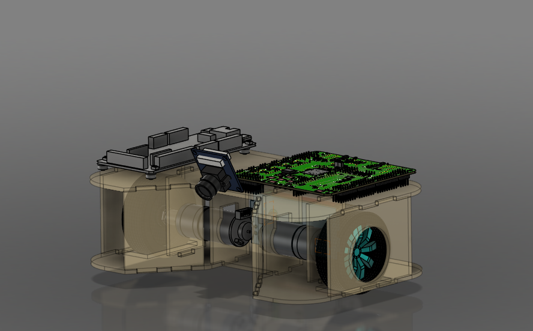
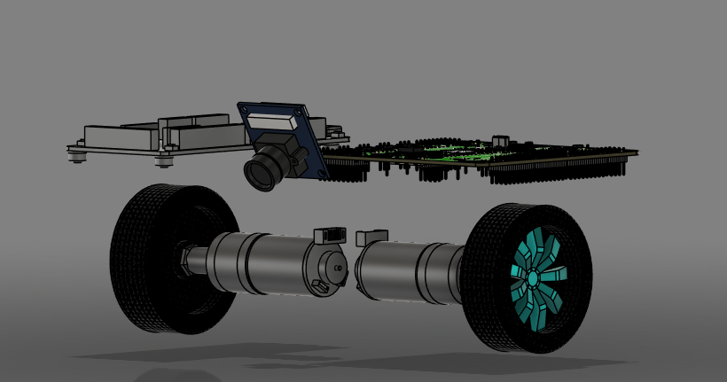

# FalconEye

FalconEye is a mobile robot designed for the **Puck Collect** competition - Prague robotics day 2025. Its primary task is to use a camera to detect pucks on the field and transport them to a designated area.

## Overview

The robot is constructed from 3mm plywood, chosen for its balance of strength, rigidity, and light weight. The chassis was designed with high modularity and robustness in mind, while still maintaining simple assembly and serviceability. The structure is optimized for stability, durability, and tactical efficiency.

## Vision System

The robot uses a camera module to detect pucks on the field. The camera streams image data to a neural network, which processes the image to obtain coordinates of the game elements. 

- The image processing and inference is done on a custom PCB from **NXP**.
- Processed data is then sent to the main control board called **RBCX**.

The neural network is fast and optimized using **TensorFlow**, enabling real-time response and adaptability during gameplay.

## Electronics

### Main Controller: RBCX

RBCX is the central processing unit of FalconEye. It integrates:
- An ESP32 microcontroller
- A co-processor
- Custom peripherals
- I2C bus for sensor communication

This board is custom-designed by specialists from **Robotárna Brno**, ensuring reliability and performance. RBCX controls the robot after the NXP board is powered on.

### Sensors

FalconEye uses the following sensors for navigation and game awareness:
- **VL53L0X** – Time-of-Flight (ToF) laser distance sensor for opponent and boundary detection.
- **TCS34725** – Color sensor to identify zones on the field (e.g. home base, puck collection area).

Both sensors communicate via I2C and are connected to the RBCX board.

## Drive System

The robot is powered by:
- **2x SGM25-370 V12 RPM 280 motors**
- Controlled via motor drivers integrated on the RBCX board

Precise and smooth movement is achieved using PID control. The combination of responsive motor control and fast neural network inference allows the robot to perform quick, accurate movements across the field – a key strategy for maximizing scoring potential.

## Power Supply

Power is supplied by:
- A custom-designed dual lithium-ion battery pack for the RBCX board
- An external power bank for the NXP board

The battery pack includes two 18650 cells integrated on a custom PCB, connected directly to RBCX via a dedicated power management board.

## Project Highlights

- 💡 Custom-designed PCBs (RBCX)
- 🧠 Real-time object detection via TensorFlow
- 🎯 Accurate motion via PID motor control
- 🔧 Modular and sturdy plywood construction

## License

This project is licensed under the MIT License – see the [LICENSE](./LICENSE) file for details.

